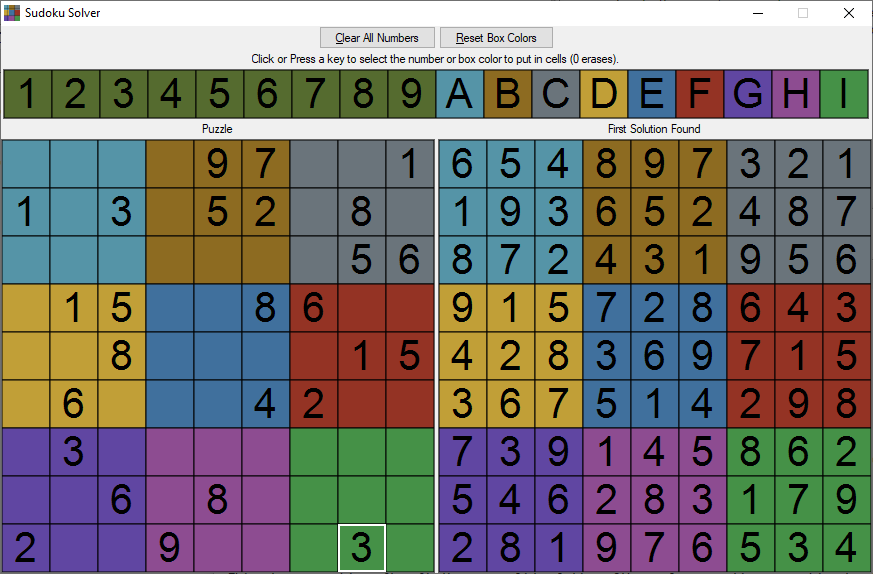
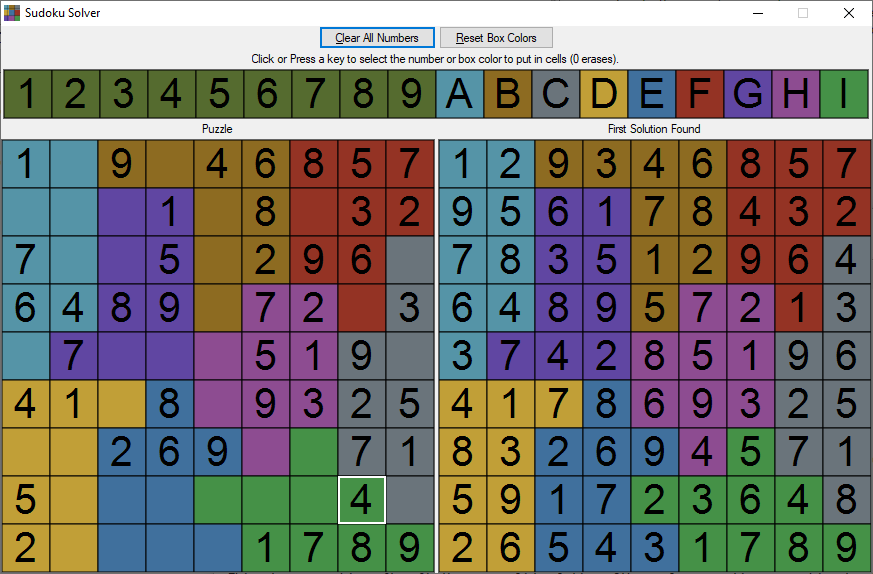

# sudoku-solver
This is a program to help solve puzzles in Microsoft Sudoku. Check out the
[download page](https://github.com/mchung94/sudoku-solver/releases)
to download a program you can run on Windows 10.

It's written in LispWorks 7.1.1 64 bit on Windows 10, not tested yet on other implementations.

There's a lot of Sudoku solvers out there. What's special about this one?
- This supports solving Sudoku puzzles with irregular shaped boxes. Regular Sudoku requires the digits 1-9 on each
  row, column, and in nine 3x3 boxes, but Microsoft Sudoku has a variant with irregular shaped boxes instead of 3x3.
- There's a downloadable executable with a simple GUI for Windows.

Things other Sudoku solvers support, but aren't supported here:
- This only supports 9x9 grids, but other solvers support different sizes.
- This stops searching after finding any valid solution. Other solvers continue searching to check if there are
  multiple solutions.
- This uses Knuth's Dancing Links / Algorithm X to solve Sudoku as an exact cover problem, but it isn't trying to be
  the fastest solver out there.

# Screenshots
Here's a screenshot of a regular Sudoku puzzle.  The puzzle is on the left and the solution is on the right:

Here's a screenshot of a Sudoku puzzle with irregular shaped boxes:

# Usage
- For Windows, [download the latest release](https://github.com/mchung94/sudoku-solver/releases) and unzip the file.
- Run sudoku-solver.exe.
- You can use either the keyboard or mouse to give it the puzzle to solve.
  - Keyboard: Use the arrow keys to choose the current cell which will be highlighted on the Puzzle grid.
    Press 1-9 to add a digit to the current cell.  Pressing the Period, Delete, or 0 keys will delete the number.
    Press A-I to change the box colors.
  - Mouse: Click on one of the squares across the top row, labeled 1 2 3 4 5 6 7 8 9 A B C D E F G H I.
    1-9 are for adding digits to the squares, A-I are for changing the box colors.
    Then click on squares in the Puzzle grid on the left. The color or digit will be added. Click again with the
    same number selected to delete the number. Pressing the Escape key will undo any selection.
- Mistakes: A number will be highlighted in red if there is a duplicate number on the same row, column, or box.
  If the box color is bad there will be a white X drawn on it.  This happens if there are not exactly nine squares
  with that box color, or if a square with the box color isn't next to another square with the same box color.
- After entering most of the numbers, a solution will appear on the "First Solution Found" grid. It's only showing
  the first solution it finds - **the answer may not be correct until the puzzle is entirely entered into the Puzzle
  grid.**
- The "Clear All Numbers" button will delete all the numbers in the puzzle.  The "Reset Box Colors" button will
  reset the colored boxes back to the nine 3x3 boxes used in regular Sudoku games. 
